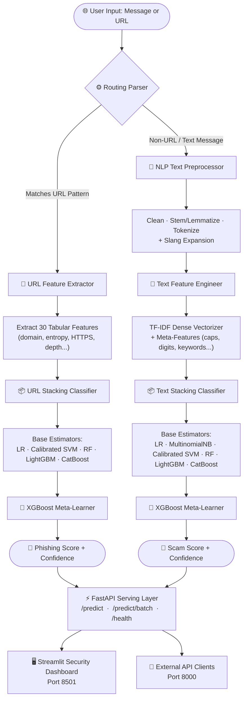
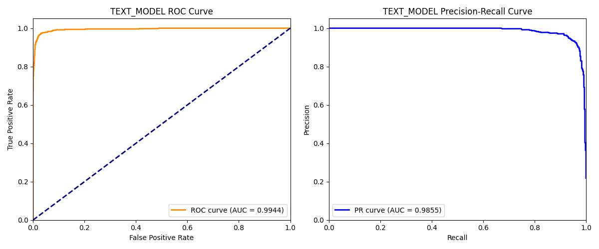
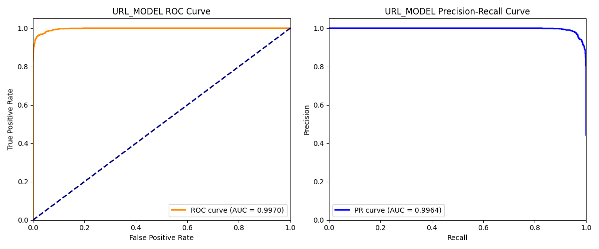

<div align="center">

<!-- HERO BANNER -->


<!-- ANIMATED TITLE -->
<a href="https://github.com/your-username/scamshield-ai">
  
</a>

<br/>

<!-- BADGES ROW 1 -->
<p>
  <a href="https://github.com/your-username/scamshield-ai/stargazers">
    
  </a>
  <a href="https://github.com/your-username/scamshield-ai/network/members">
    
  </a>
  <a href="https://github.com/your-username/scamshield-ai/issues">
    
  </a>
  <a href="https://github.com/your-username/scamshield-ai/blob/main/LICENSE">
    
  </a>
</p>

<!-- BADGES ROW 2 -->
<p>
  
  
  
  
  
  
</p>

<!-- BADGES ROW 3 -->
<p>
  
  
  <a href="https://github.com/your-username/scamshield-ai/actions">
    
  </a>
  
</p>

<br/>

**[🚀 Live Demo](https://your-demo-link.com)** • **[📖 API Docs](http://localhost:8000/docs)** • **[📊 Model Report](./reports/)** • **[💬 Discussions](https://github.com/your-username/scamshield-ai/discussions)**

<br/>

</div>

---

## 📸 Project Preview

<div align="center">

| 🛡️ Security Dashboard | 🔍 Live Scanner | 📊 Analytics |
|:---:|:---:|:---:|
|  |  |  |

> 🎯 **Replace placeholders above** with your actual screenshots once deployed. Add GIFs for extra flair!

</div>

---

## 🚨 The Problem

Every second, **millions of people** receive scam SMS messages and phishing URLs designed to steal credentials, drain bank accounts, and compromise personal data. The cybersecurity industry faces three compounding crises:

- **📈 Scale:** Over 3.4 billion phishing emails are sent daily; spam SMS costs the global economy $20B+ per year
- **🧠 Evasion:** Modern scammers use AI-generated text that bypasses keyword filters and rule-based systems
- **⏱️ Latency:** Existing enterprise solutions are cloud-locked, expensive, and too slow for real-time consumer protection
- **🔀 Fragmentation:** No single open-source tool handles both SMS/email text AND URL classification under one inference API

ScamShield AI was built to solve all four problems simultaneously — an open, fast, accurate, dual-vector scam detection engine that anyone can self-host in minutes.

---

## 🔭 Vision

ScamShield AI is more than a classifier — it's a **foundational security primitive**.

The architecture is deliberately modular and extensible so the community can build on top of it:

- 🌐 **Browser Extension** — real-time URL scanning before you click
- 📱 **Mobile SDK** — embeddable scam detection for iOS / Android apps
- 🤝 **Telecom API Gateway** — carrier-level filtering at network ingress
- 🏢 **Enterprise SIEM Integration** — feed predictions into Splunk, Elastic, or Datadog
- 🤖 **LLM-Augmented Reasoning** — hybrid classical ML + LLM explanation layer for explainability

The 97%+ accuracy achieved without large language models demonstrates that **efficient, explainable ML** can rival deep learning for structured cybersecurity tasks — a key insight for production deployments where latency and cost matter.

---

## ✨ Features

<table>
<tr>
<td width="50%">

### 🧠 ML & AI Intelligence
- **Dual-Vector Detection** — independent pipelines for text (SMS/email) and URL classification
- **6-Model Stacking Ensemble** — LR + NB + Calibrated SVM + RF + LightGBM + CatBoost fused by XGBoost meta-learner
- **TF-IDF + Meta-Feature Fusion** — combines n-gram vectors with structural text signals (capitalization ratio, digit frequency, keyword density)
- **30 URL Tabular Features** — domain age, HTTPS presence, subdomain depth, entropy analysis, and more
- **Singleton Inference Engine** — one model load, unlimited concurrent predictions
- **Stratified K-Fold Cross-Validation** — 5-fold CV for unbiased ensemble training

</td>
<td width="50%">

### ⚡ Production Architecture
- **Unified Routing Parser** — auto-detects input type (URL vs text) with regex heuristics; no manual flag required
- **FastAPI Backend** — async REST API with Pydantic v2 validation, CORS middleware, and per-request latency headers
- **Batch Inference Endpoint** — process hundreds of inputs in a single API call with aggregate scam statistics
- **Streamlit Security Dashboard** — glassmorphism UI with live scan, batch upload, and Plotly analytics
- **Docker Compose Orchestration** — one-command multi-container deployment
- **GitHub Actions CI/CD** — automated linting, import validation, and Docker dry-run builds on every PR

</td>
</tr>
<tr>
<td width="50%">

### 📊 Evaluation & Reporting
- **ROC & Precision-Recall Curves** — auto-generated at training time, saved to `reports/`
- **Structured Metrics JSON** — machine-readable evaluation scores for downstream dashboards
- **Confidence Scores** — every prediction returns a calibrated probability, not just a binary label
- **Class-Balanced Training** — handles imbalanced scam/legitimate ratios with `class_weight="balanced"` and CatBoost auto-balancing

</td>
<td width="50%">

### 🔧 Developer Experience
- **Jupyter Notebooks** — full EDA, preprocessing, training, and evaluation walkthroughs
- **Custom Log Rotator** — structured timestamped logs with rotation for both backend and ML pipelines
- **PYTHONPATH-free Imports** — clean module resolution via dynamic `sys.path` injection
- **Local Fallback Mode** — Streamlit frontend directly loads ML models if backend API is offline
- **Beginner-friendly Setup** — virtualenv, pip, and `PYTHONPATH=.` are the only requirements

</td>
</tr>
</table>

---

## 🏗️ System Architecture

### Inference Flow



### Training Pipeline

```mermaid
flowchart LR
    A["📁 Raw Datasets\nsms_spam.csv · phishing.csv"] --> B["🔧 Preprocessing\nClean · Stem · Normalize"]
    B --> C["🔬 Feature Engineering\nTF-IDF + Meta / URL Tabular"]
    C --> D["🧪 Stratified Train/Test Split\n80% / 20%"]
    D --> E["🏋️ 5-Fold CV Stacking\n6 Base Models per Pipeline"]
    E --> F["🧠 XGBoost Meta-Learner Fit"]
    F --> G["📊 Evaluation\nROC · PR · F1 · AUC"]
    G --> H["💾 Serialize\n.pkl Models + Vectorizers"]
    H --> I["📈 Reports\nmetrics.json · PNG Curves"]
```



---

## 📁 Project Structure

```text
scamshield-ai/
├── .github/
│   └── workflows/
│       └── ci-cd.yml               # GitHub Actions: lint → test → Docker dry-run
│
├── backend/
│   ├── app/
│   │   └── main.py                 # FastAPI app · 3 endpoints · CORS · request logging
│   └── Dockerfile                  # Multi-stage production image for backend
│
├── datasets/
│   └── raw/
│       ├── sms_spam.csv            # SMS/email scam dataset
│       └── phishing.csv            # URL phishing feature dataset (30 columns)
│
├── frontend/
│   ├── app.py                      # Streamlit Security Center · glassmorphism UI · Plotly charts
│   └── Dockerfile                  # Frontend production image
│
├── ml/
│   ├── config/
│   │   └── config.py               # Central path config · TF-IDF params · model filenames
│   ├── models/                     # 📦 Serialized stacking ensembles (.pkl) — gitignored
│   ├── pipelines/
│   │   ├── preprocessing.py        # NLP: clean · stem · lemmatize · slang expansion
│   │   ├── features.py             # TF-IDF + meta features (text) · URL tabular extractor
│   │   ├── model.py                # StackingClassifier builders for text & URL
│   │   ├── train.py                # End-to-end training · evaluation · plot generation
│   │   └── inference.py            # Singleton ScamShieldInference · routing · predict()
│   ├── utils/
│   │   └── logger.py               # Custom rotating file + stream logger
│   └── vectorizers/                # 📦 Serialized TF-IDF vectorizers (.pkl) — gitignored
│
├── notebooks/
│   ├── 01_eda.ipynb                # Exploratory Data Analysis
│   ├── 02_preprocessing.ipynb      # Preprocessing walkthrough
│   ├── 03_model_training.ipynb     # Full training notebook
│   └── 04_evaluation.ipynb         # Metrics & visualization
│
├── reports/
│   ├── metrics.json                # Machine-readable evaluation scores
│   ├── text_model_evaluation_curves.png
│   └── url_model_evaluation_curves.png
│
├── tests/
│   ├── test_inference.py           # Inference unit tests
│   └── inspect_notebooks.py        # Notebook cell inspection utility
│
├── docker-compose.yml              # Orchestrates backend (8000) + frontend (8501)
├── requirements.txt                # Pinned dependency lockfile
└── setup.py                        # Package entrypoint
```

---

## 📈 Model Performance

Both stacking ensembles were evaluated on stratified 20% holdout test sets. Results are saved to `reports/metrics.json`.

<div align="center">

| Metric | 📝 SMS/Email Text Model | 🔗 URL Phishing Model |
|:---|:---:|:---:|
| **Accuracy** | `97.39%` | `97.11%` |
| **Precision** | `93.75%` | `97.12%` |
| **Recall** | `94.34%` | `96.32%` |
| **F1-Score** | `94.04%` | `96.72%` |
| **ROC-AUC** | `99.44%` | `99.70%` |

</div>

<div align="center">

| Text Model Evaluation Curves | URL Model Evaluation Curves |
|:---:|:---:|
|  |  |

</div>

---

## 🚀 Quick Start

### Prerequisites

- Python 3.10+
- Git
- Docker & Docker Compose _(optional, for containerized deployment)_

### 1. Clone the Repository

```bash
git clone https://github.com/your-username/scamshield-ai.git
cd scamshield-ai
```

### 2. Create & Activate Virtual Environment

```bash
python3 -m venv venv

# Linux / macOS
source venv/bin/activate

# Windows (PowerShell)
venv\Scripts\Activate.ps1
```

### 3. Install Dependencies

```bash
pip install --upgrade pip
pip install -r requirements.txt
```

### 4. Download NLTK Resources _(first-time only)_

```python
python -c "import nltk; nltk.download('stopwords'); nltk.download('wordnet')"
```

### 5. Train the Stacking Ensembles

This trains both models, generates evaluation curves in `reports/`, and serializes pickles to `ml/models/` and `ml/vectorizers/`.

```bash
PYTHONPATH=. python ml/pipelines/train.py
```

> ⏱️ Training takes ~5–15 minutes depending on your hardware. Progress is logged to the console and to `ml/logs/scamshield.log`.

### 6. Start the Services

**Backend (FastAPI) — port `8000`:**
```bash
PYTHONPATH=. uvicorn backend.app.main:app --host 0.0.0.0 --port 8000 --reload
```

**Frontend (Streamlit) — port `8501`:**
```bash
PYTHONPATH=. streamlit run frontend/app.py
```

### 7. Verify Everything Works

```bash
curl http://localhost:8000/health
# Expected: {"status":"healthy","message":"All models loaded and inference engine ready."}
```

Then open **http://localhost:8501** in your browser for the Security Dashboard.

---

## 🐳 Docker Deployment

Deploy the entire stack with one command:

```bash
# Build and start both containers
docker-compose up --build

# Run in detached (background) mode
docker-compose up --build -d

# View logs
docker-compose logs -f

# Stop all services
docker-compose down
```

**Service URLs after startup:**

| Service | URL |
|:---|:---|
| FastAPI Backend | http://localhost:8000 |
| Swagger UI / API Docs | http://localhost:8000/docs |
| ReDoc API Reference | http://localhost:8000/redoc |
| Streamlit Security Dashboard | http://localhost:8501 |

> 💡 **Note:** The Docker setup mounts `ml/models/`, `ml/vectorizers/`, and `reports/` as volumes. You must train the models locally first (`python ml/pipelines/train.py`) before running Docker, or add the training step to your Dockerfile.

---

## 🔌 API Reference

### `GET /health`

Returns server status and model load verification.

```bash
curl http://localhost:8000/health
```

```json
{
  "status": "healthy",
  "message": "All models loaded and inference engine ready."
}
```

---

### `POST /predict`

Classifies a single input (SMS text, email body, or URL). The routing engine auto-detects the input type.

```bash
curl -X POST http://localhost:8000/predict \
  -H "Content-Type: application/json" \
  -d '{"text": "Congratulations! You won a free Target gift card. Claim now: http://fraud-link-claims.com"}'
```

**Response:**
```json
{
  "input_type": "TEXT",
  "prediction": "SCAM",
  "label": 1,
  "confidence": 0.9842,
  "details": "Cleaned tokens: 'congratul won free target gift card claim'"
}
```

**URL Example:**
```bash
curl -X POST http://localhost:8000/predict \
  -H "Content-Type: application/json" \
  -d '{"text": "http://verify-bank-login-alert.info"}'
```

```json
{
  "input_type": "URL",
  "prediction": "PHISHING",
  "label": 1,
  "confidence": 0.9781,
  "details": "Processed as URL. Features matched: [0.0, 1.0, 1.0, 1.0, -1.0, 0.0, 0.0, 1.0]"
}
```

---

### `POST /predict/batch`

Classifies a list of inputs in one call. Returns individual results plus aggregate statistics.

```bash
curl -X POST http://localhost:8000/predict/batch \
  -H "Content-Type: application/json" \
  -d '{
    "inputs": [
      "Hey! Are you free for a call tonight?",
      "http://verify-bank-login-alert.info",
      "URGENT: Your account has been suspended. Verify now."
    ]
  }'
```

**Response:**
```json
{
  "results": [
    {
      "input_type": "TEXT",
      "prediction": "SAFE",
      "label": 0,
      "confidence": 0.9992,
      "details": "Cleaned tokens: 'hey free call tonight'"
    },
    {
      "input_type": "URL",
      "prediction": "PHISHING",
      "label": 1,
      "confidence": 0.9781,
      "details": "Processed as URL."
    },
    {
      "input_type": "TEXT",
      "prediction": "SCAM",
      "label": 1,
      "confidence": 0.9655,
      "details": "Cleaned tokens: 'urgent account suspend verif'"
    }
  ],
  "total_processed": 3,
  "scam_count": 2
}
```

**Response Field Reference:**

| Field | Type | Description |
|:---|:---|:---|
| `input_type` | `string` | `TEXT` or `URL` |
| `prediction` | `string` | `SAFE`, `SCAM`, or `PHISHING` |
| `label` | `int` | `0` = safe, `1` = threat |
| `confidence` | `float` | Calibrated probability `[0.0, 1.0]` |
| `details` | `string` | Preprocessing trace or URL feature summary |

---

## 🤖 ML / AI Deep Dive

### Datasets

| Dataset | Source | Size | Task |
|:---|:---|:---|:---|
| `sms_spam.csv` | UCI SMS Spam Collection + augmented | ~5.5K rows | SMS/Email text classification |
| `phishing.csv` | UCI Phishing Website Dataset | ~11K rows, 30 features | URL phishing detection |

### Ensemble Architecture

ScamShield uses **two independent stacking ensembles** — one per input modality — both with XGBoost as the meta-learner.

**Text Stacking Ensemble:**
```
Level 0 (Base Learners):
  ├── LogisticRegression      (max_iter=1000, class_weight="balanced")
  ├── MultinomialNB           (TF-IDF compatible)
  ├── CalibratedSVM           (LinearSVC wrapped in CalibratedClassifierCV)
  ├── RandomForest            (n_estimators=100, class_weight="balanced")
  ├── LightGBM                (class_weight="balanced")
  └── CatBoost                (auto_class_weights="Balanced")

Level 1 (Meta-Learner):
  └── XGBoost                 (n_estimators=100, lr=0.05, max_depth=4)

Cross-Validation: 5-Fold Stratified (cv=5)
```

**URL Stacking Ensemble:**
```
Level 0 (Base Learners):
  ├── LogisticRegression
  ├── CalibratedSVM           (MultinomialNB excluded — URL features contain negative values)
  ├── RandomForest
  ├── LightGBM
  └── CatBoost

Level 1 (Meta-Learner):
  └── XGBoost
```

### Text Feature Engineering

Each text sample is transformed into a high-dimensional hybrid representation:

1. **TF-IDF Vectorization** — 5,000-feature unigram + bigram sparse matrix
2. **Meta-Feature Vector** — 6 structural signals:
   - Character length
   - Word count
   - Uppercase character ratio
   - Digit frequency ratio
   - Special symbol frequency
   - Scam keyword hit count (22 keywords)
3. **Sparse + Dense Fusion** — `scipy.hstack` merges TF-IDF and meta-features into a unified matrix

### URL Feature Engineering

30 tabular features extracted directly from URL structure — no external API calls required:

- HTTPS flag, domain length, URL length
- Special character counts (`@`, `-`, `//`, `www`)
- Subdomain depth, path depth, query string presence
- IP address pattern detection
- URL entropy (Shannon entropy of character distribution)
- And 20+ additional structural indicators

### Inference Engine

The `ScamShieldInference` class implements the **Singleton pattern** — models are loaded from disk exactly once per process, then cached for all subsequent predictions. This ensures sub-millisecond routing overhead even under high concurrency.

```
Input → is_url() heuristic → [URL path] or [Text path]
Text path: preprocess → vectorize → stack predict → confidence
URL path:  parse → extract 30 features → stack predict → confidence
```

---

## ⚡ Performance & Optimization

- **Singleton Model Loading** — prevents redundant I/O; models load once at `startup_event()` and persist in memory
- **Joblib Serialization** — `joblib.dump` / `joblib.load` with compression for fast pickle I/O on large ensembles
- **`n_jobs=-1` Parallelism** — Random Forest, LightGBM, and XGBoost use all CPU cores during training
- **`read-only` Dataset Loading** — training uses chunked pandas reads for large CSVs
- **Async FastAPI Middleware** — latency is tracked per request and injected as `X-Process-Time` response header
- **Docker Volume Mounts** — model files are mounted at runtime, not baked into the image, enabling hot-swap model updates without rebuilds
- **Streamlit Local Fallback** — if backend is unreachable, Streamlit imports `ScamShieldInference` directly — zero downtime for offline demos

---

## 🔒 Security

- **Input Validation** — all API inputs go through Pydantic v2 schema validation before touching the inference engine
- **CORS Configuration** — `CORSMiddleware` is configured with `allow_origins=["*"]` for development; restrict to specific origins in production
- **No External Model APIs** — all inference is fully local; no data leaves your infrastructure
- **Error Isolation** — batch inference wraps each item in its own try/except; one bad input cannot crash the batch
- **Environment Separation** — backend URL is passed via `BACKEND_API_URL` environment variable; never hardcoded
- **Log Rotation** — custom logger uses rotating file handlers to prevent log-based disk exhaustion in production
- **Model Files Gitignored** — serialized `.pkl` files are excluded from version control; train locally or via CI artifacts

> ⚠️ **Production Hardening Checklist:** Before public deployment, restrict CORS origins, add API key authentication (e.g., HTTP Bearer tokens via FastAPI's `Security` dependency), enable HTTPS via reverse proxy (Nginx/Caddy), and rate-limit the `/predict/batch` endpoint.

---

## 🗺️ Roadmap

- [x] Dual-vector stacking ensemble (text + URL)
- [x] FastAPI REST API with batch support
- [x] Streamlit Security Dashboard with glassmorphism UI
- [x] Docker Compose orchestration
- [x] GitHub Actions CI/CD pipeline
- [x] Jupyter notebook suite (EDA → train → eval)
- [ ] 🔐 API key authentication middleware
- [ ] 📊 Prometheus metrics endpoint + Grafana dashboard
- [ ] 🌐 Browser extension (Chrome/Firefox) for real-time URL scanning
- [ ] 📱 React Native mobile SDK
- [ ] 🤗 Hugging Face model card + public dataset release
- [ ] 🧠 LLM explanation layer (GPT-4o / Claude API) for human-readable threat summaries
- [ ] 📡 Webhook support for real-time alert delivery (Slack, PagerDuty)
- [ ] 🐘 PostgreSQL prediction logging + audit trail
- [ ] ☸️ Kubernetes Helm chart for cloud-native deployment
- [ ] 🔄 Active learning pipeline for continuous model improvement

---

## 🧪 Testing

### Run Unit Tests

```bash
PYTHONPATH=. pytest tests/ -v
```

### Run Import / Inference Smoke Test

```bash
PYTHONPATH=. python -c "
from ml.pipelines.inference import ScamShieldInference
engine = ScamShieldInference()
result = engine.predict('Congratulations! You won a prize.')
print(result)
"
```

### Run Notebook Inspection

```bash
PYTHONPATH=. python tests/inspect_notebooks.py
```

### Lint with Flake8

```bash
# Syntax errors and undefined names (hard fail)
flake8 . --count --select=E9,F63,F7,F82 --show-source --statistics

# Style warnings (soft fail, max line length 127)
flake8 . --count --exit-zero --max-complexity=10 --max-line-length=127 --statistics
```

---

## 📦 CI/CD Pipeline

The `.github/workflows/ci-cd.yml` pipeline runs on every push to `main` / `master` and on all pull requests:

```
Push / PR → [Job 1: lint-and-test]
              ├── Checkout code
              ├── Setup Python 3.11
              ├── Install system deps (libgomp1 for LightGBM)
              ├── pip install -r requirements.txt
              ├── flake8 syntax lint
              └── Inference import smoke test

           → [Job 2: docker-dry-run-build]  (depends on Job 1)
              ├── Build backend Docker image (push: false)
              └── Build frontend Docker image (push: false)
```

---

## ☁️ Cloud Deployment

### AWS EC2 / GCP Compute Engine / DigitalOcean Droplet

```bash
# On your remote server
git clone https://github.com/your-username/scamshield-ai.git
cd scamshield-ai

# Train models (or copy pre-trained .pkl files)
PYTHONPATH=. python ml/pipelines/train.py

# Deploy with Docker
docker-compose up --build -d

# Open firewall ports 8000 and 8501
```

### Environment Variables for Production

| Variable | Default | Description |
|:---|:---|:---|
| `BACKEND_API_URL` | `http://localhost:8000` | Backend URL used by Streamlit frontend |
| `PYTHONPATH` | `.` | Project root for module resolution |

---

## 🤝 Contributing

Contributions are what make the open-source community extraordinary. All contributions — big or small — are genuinely welcome.

### Getting Started

```bash
# 1. Fork the repository on GitHub

# 2. Clone your fork
git clone https://github.com/YOUR-USERNAME/scamshield-ai.git
cd scamshield-ai

# 3. Create a feature branch
git checkout -b feat/your-feature-name

# 4. Make your changes and commit
git add .
git commit -m "feat: add your feature description"

# 5. Push and open a Pull Request
git push origin feat/your-feature-name
```

### Branch Naming Conventions

| Type | Pattern | Example |
|:---|:---|:---|
| Feature | `feat/...` | `feat/browser-extension` |
| Bug Fix | `fix/...` | `fix/url-regex-edge-case` |
| Documentation | `docs/...` | `docs/add-api-examples` |
| Refactor | `refactor/...` | `refactor/inference-engine` |
| Tests | `test/...` | `test/add-batch-unit-tests` |

### Coding Standards

- Follow **PEP 8** (enforced via Flake8 in CI)
- Max line length: **127 characters**
- All new functions must have **docstrings**
- All new endpoints must have **Pydantic schemas**
- Tests go in `tests/` and must be runnable with `pytest`

### What to Contribute

- 🐛 Bug fixes and edge case handling
- 🧪 Additional unit and integration tests
- 📊 New feature engineering ideas (URL features, text signals)
- 📖 Documentation improvements
- 🌍 Multilingual scam detection (non-English datasets)
- 🔌 New API integrations (webhooks, auth, rate limiting)

---

## ❓ FAQ

<details>
<summary><b>Do I need a GPU to train the models?</b></summary>

No. ScamShield uses classical ML algorithms (LightGBM, XGBoost, CatBoost, Scikit-learn) that train efficiently on CPU. Training on an 8-core laptop takes roughly 5–15 minutes.

</details>

<details>
<summary><b>The training script fails with a FileNotFoundError.</b></summary>

Ensure both dataset files exist at `datasets/raw/sms_spam.csv` and `datasets/raw/phishing.csv`. These are included in the repository. If you deleted them, re-clone or download from the UCI ML Repository.

</details>

<details>
<summary><b>Streamlit shows "Backend offline" / can't connect to the API.</b></summary>

Streamlit automatically falls back to loading the ML models directly if `LOCAL_MODEL_AVAILABLE = True`. To use the API mode, ensure the FastAPI backend is running on port `8000` and set `BACKEND_API_URL` if using a non-default host.

</details>

<details>
<summary><b>How do I retrain the model with new data?</b></summary>

Replace or augment the CSV files in `datasets/raw/`, then re-run:
```bash
PYTHONPATH=. python ml/pipelines/train.py
```
New `.pkl` files will overwrite the existing ones in `ml/models/` and `ml/vectorizers/`.

</details>

<details>
<summary><b>Can I use ScamShield in a commercial product?</b></summary>

Yes — the MIT License permits commercial use, modification, and distribution. Attribution is appreciated but not required.

</details>

<details>
<summary><b>Why is MultinomialNB excluded from the URL ensemble?</b></summary>

MultinomialNB requires non-negative feature values. The URL phishing dataset (`phishing.csv`) encodes some features as `-1` (e.g., "unknown" state), which causes MultinomialNB to raise a `ValueError`. All other base estimators handle negative features correctly.

</details>

---

## 👤 Author

<div align="center">


**Your Name**

_AI/ML Engineer · Full-Stack Developer · Open Source Contributor_

[](https://github.com/your-username)
[](https://linkedin.com/in/your-profile)
[](https://your-portfolio.com)
[](mailto:your@email.com)

</div>

---

## 💖 Support the Project

If ScamShield AI has been useful to you, here's how you can support it:

- ⭐ **Star the repository** — it helps others discover the project
- 🍴 **Fork and build** — create something new on top of ScamShield
- 🐛 **Report bugs** — open an issue with full reproduction steps
- 💡 **Suggest features** — start a GitHub Discussion
- 🤝 **Contribute code** — see the Contributing section above
- 📢 **Share it** — tweet, post, or mention it in your community

Every star, fork, and pull request genuinely motivates continued development.

---

## 📄 License

```
MIT License

Copyright (c) 2026 Your Name

Permission is hereby granted, free of charge, to any person obtaining a copy
of this software and associated documentation files (the "Software"), to deal
in the Software without restriction, including without limitation the rights
to use, copy, modify, merge, publish, distribute, sublicense, and/or sell
copies of the Software, and to permit persons to whom the Software is
furnished to do so, subject to the following conditions:

The above copyright notice and this permission notice shall be included in all
copies or substantial portions of the Software.

THE SOFTWARE IS PROVIDED "AS IS", WITHOUT WARRANTY OF ANY KIND, EXPRESS OR
IMPLIED, INCLUDING BUT NOT LIMITED TO THE WARRANTIES OF MERCHANTABILITY,
FITNESS FOR A PARTICULAR PURPOSE AND NONINFRINGEMENT.
```

See [LICENSE](./LICENSE) for the full text.

---

<div align="center">


**Built with 🛡️ and Python by the open-source community**

_Protecting people from scams, one prediction at a time._

<br/>

[](https://github.com/your-username/scamshield-ai)

</div>
