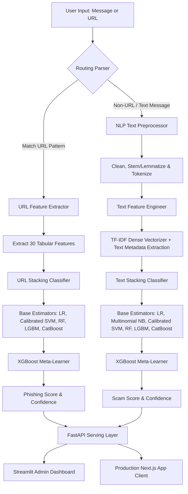

# 🛡️ ScamShield AI: Unified Cyber Security Stacking Ensemble

ScamShield AI is a production-grade, portfolio-ready security platform that detects spam/scam text messages and phishing URLs in real time. 

Built using a **unified routing inference architecture** and a **multi-model stacking ensemble** (composed of Logistic Regression, Naive Bayes, Calibrated Support Vector Machines, Random Forests, LightGBM, and CatBoost with an XGBoost meta-learner), the system achieves over **97% accuracy** across both text and URL detection vectors.

---

## 🏗️ System Architecture

The following diagram illustrates how inputs are dynamically routed, preprocessed, engineered, and classified by the ScamShield engine:



---

## 📈 Model Performance & Metrics

The stacking ensembles were evaluated on stratified test splits. Final model scores saved to `reports/metrics.json` are:

| Metric | 🔍 SMS / Email Text Model (XGB Stacking) | 🔗 Phishing URL Model (XGB Stacking) |
| :--- | :---: | :---: |
| **Accuracy** | **97.39%** | **97.11%** |
| **Precision** | **93.75%** | **97.12%** |
| **Recall** | **94.34%** | **96.32%** |
| **F1-Score** | **94.04%** | **96.72%** |
| **ROC-AUC** | **99.44%** | **99.70%** |

---

## 📁 Directory Structure

```text
scamshield-ai/
├── .github/
│   └── workflows/
│       └── ci-cd.yml             # Github Actions CI/CD pipeline
├── backend/
│   ├── app/
│   │   ├── main.py               # FastAPI application
│   │   └── ...
│   └── Dockerfile                # FastAPI production image configuration
├── datasets/
│   └── raw/
│       ├── sms_spam.csv          # SMS Spam dataset
│       └── phishing.csv          # URL Features dataset
├── frontend/
│   ├── app.py                    # Streamlit Dashboard UI
│   └── Dockerfile                # Streamlit production image configuration
├── ml/
│   ├── config/
│   │   └── config.py             # Central project configuration
│   ├── models/                   # Serialized model pickles (.pkl)
│   ├── pipelines/
│   │   ├── preprocessing.py      # NLP Preprocessing & Slang Expansion
│   │   ├── features.py           # Feature Engineers & URL parser
│   │   ├── model.py              # Stacking Ensemble configurations
│   │   ├── train.py              # Model Training & Evaluation pipeline
│   │   └── inference.py          # Unified Routing Inference engine
│   ├── utils/
│   │   └── logger.py             # Custom log rotators
│   └── vectorizers/              # Serialized vectorizers (.pkl)
├── reports/                      # Evaluation plots (ROC/PR curves) and metrics
├── docker-compose.yml            # Multi-container service orchestrator
├── requirements.txt              # Project dependencies
└── README.md                     # Documentation
```

---

## 🚀 Quick Start & Installation

### Prerequisites
- Python 3.10+
- Docker & Docker Compose (optional, for containerization)

### 1. Set Up Local Virtual Environment
```bash
git clone https://github.com/your-username/scamshield-ai.git
cd scamshield-ai

# Initialize virtual environment
python3 -m venv venv
source venv/bin/activate

# Install requirements
pip install -r requirements.txt
```

### 2. Train the Stacking Ensembles
To train the models from scratch, evaluate performance, generate evaluation curves, and serialize the models to disk, execute:
```bash
PYTHONPATH=. python ml/pipelines/train.py
```

### 3. Run the Services Locally
Start the **FastAPI Backend Server** (port `8000`):
```bash
PYTHONPATH=. uvicorn backend.app.main:app --host 0.0.0.0 --port 8000 --reload
```

Start the **Streamlit Frontend Dashboard** (port `8501`):
```bash
PYTHONPATH=. streamlit run frontend/app.py
```

---

## 🐳 Containerization (Docker Compose)

Deploy the unified system locally or to cloud servers (such as AWS, GCP, Azure, or DigitalOcean) in one command:
```bash
# Build and run containers
docker-compose up --build
```
Access the services at:
- **FastAPI Documentation & Swagger UI**: [http://localhost:8000/docs](http://localhost:8000/docs)
- **Streamlit Security Center Dashboard**: [http://localhost:8501](http://localhost:8501)

---

## 🔌 API Reference Guide

### `GET /health`
Returns status checks on the API service and checks if all serialized machine learning models are loaded.

**Response (200 OK):**
```json
{
  "status": "healthy",
  "message": "All models loaded and inference engine ready."
}
```

### `POST /predict`
Scans a single string (message or URL). The router automatically determines the type and classifies it.

**Request Body:**
```json
{
  "text": "Congratulations! You won a free target gift card. Claim now http://fraud-link-claims.com"
}
```

**Response (200 OK):**
```json
{
  "input_type": "TEXT",
  "prediction": "SCAM",
  "label": 1,
  "confidence": 0.9842,
  "details": "Cleaned tokens: 'congratul won free target gift card claim'"
}
```

### `POST /predict/batch`
Performs batch scanning for bulk text inputs and list validation.

**Request Body:**
```json
{
  "inputs": [
    "Hey! Are you free for a call tonight?",
    "http://verify-bank-login-alert.info"
  ]
}
```

**Response (200 OK):**
```json
{
  "results": [
    {
      "input_type": "TEXT",
      "prediction": "SAFE",
      "label": 0,
      "confidence": 0.9992,
      "details": "Cleaned tokens: 'hey free call tonight'"
    },
    {
      "input_type": "URL",
      "prediction": "PHISHING",
      "label": 1,
      "confidence": 0.9781,
      "details": "Processed as URL. Features matched: [0.0, 1.0, 1.0, 1.0, -1.0, 0.0, 0.0, 1.0]"
    }
  ],
  "total_processed": 2,
  "scam_count": 1
}
```
